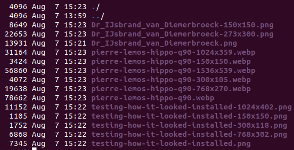

# WP Server Side Image Optimiser


Uses imagemagick to scale and save images more efficiently than WordPress.

Unlike my original client side version, the cloud test environment is not
containerised. This is so the tests can more uniformly integrate with all
the ends they require. Although only a very simple WordPress installation,
it was copied across to this server side tool for testing. This taught me a
lot about migrating WordPress which I hope to have crystallised here.

The client side required a lot of user interaction still. That automates
much of the rigmarole of resizing an image efficiently but is by no means
transparent to WordPress users. I suspect the only people that don't need
transparent, fire-and-forget, tools for their WordPress are backend developers
who think in code, not images.

## Running tests locally

```shell
vagrant up
```

These can be repeated by shelling into vagrant and repeating the test blocks
from the Vagrantfile:

```shell
cd /vagrant/tests
export PYTHONPATH=/vagrant/ss_img_shrinker
pytest
coverage run --source="../ss_img_shrinker" -m pytest
coverage report -m --fail-under=90
```

They depend on, and pull, [wp_app_api](https://github.com/ployt0/wp_app_api).


## Install and run on a WordPress server

[`tests/config.json`](tests/config.json) will need copying to the directory the
script is launched in, and adapting.

There should be no need to modify PYTHONPATH and it should ideally run 
periodically as a service in a unit file. Or a cron job if that is easier.

The only parameter is an optional config file path. The default being to the
sister `config.json`.

```shell
python3 optimiser.py
```


### config.json

Two keys are required by the optimiser.py script; "sql" and "wp_server":

```json
{
  "sql": {
    "host": "172.17.0.2",
    "user": "wordpressuser232",
    "password": "galoshes",
    "database": "wordpress"
  },
  "wp_server": {
    "wp_uploads": "/var/www/html/wp-content/uploads/",
    "png_q": 32,
    "webp_mp_to_max_q": {
      "0": 70, 
      "1": 60, 
      "2": 50,
      "4": 50
    }
  }
}
```

The "api" key is only for the tests. Tests that automate uploading of images.

"webp_mp_to_max_q" requires explanation. The keys are megapixels, 0 is required
and if there are no other keys 0 will be used. The webp image will take its q
value from the biggest key smaller than its megapixels. This way large images
can be included more cheaply, if that's your preference.

"wp_uploads" is needed, among other things, to limit the hierarchy of folders
we examine for changes.

The record of the last changes we have observed, and made, is contained in
the sister "latest_mods.csv" which we create on the fly if needed.

### Dependencies

- WordPress
- imagemagick

requirements.txt is only for the tests.

## Background


I wrote about the manual commands to do something about
[WordPress's wasted storage when resizing uploaded images](
https://silverbullets.co.uk/wordpress/wordpress-image-resizing-png-jpg-and-webp/).
Typing them was time-consuming and a potential barrier to self-hosting images.
While my shell's history was full of them (or more likely my PC full of
terminals left open to do this day after day) I was reasonably safe from error.

I wrote that post 6 months ago and had to re-read it before going ahead
with writing more posts. What better way to return to productivity than that
script I'd been hankering after.

I made that for the client, potentially with a test WordPress deployment, to
resize images and pick what they preferred to upload.

After running this for some time I found it was still a lot of operations to
remember and hence error prone. What might be better is a script on the server.
I looked into inotify, and mstat on a directory. What I know and love are
systemd services. I want to check every 5, 10, 15 minutes and if the script
dies it has just 15m to wait. I can make it transactional. What put me off
inotify was that the mstat alternative only updated with modifications directly
inside of a certain directory and not recursively, inside its subdirectories.

A common solution is to begin inotify on the subdirectories. I don't like this;
it creates a race. Point in time polling isn't busy waiting if it is infrequent.

## Images used in testing:




